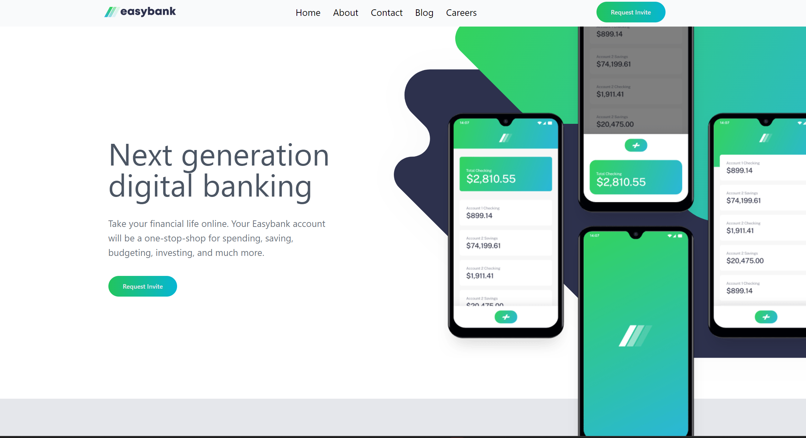
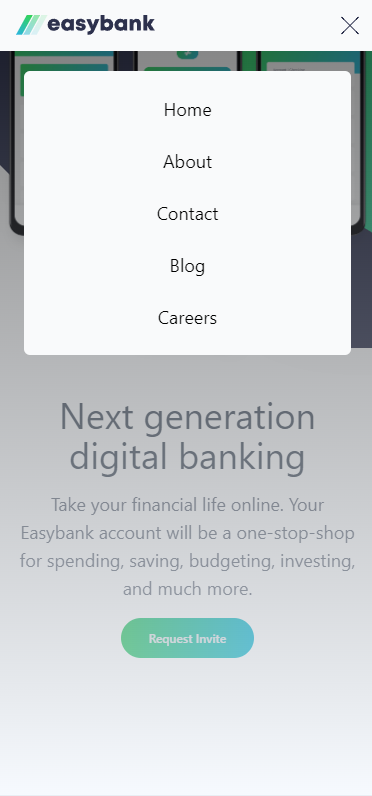
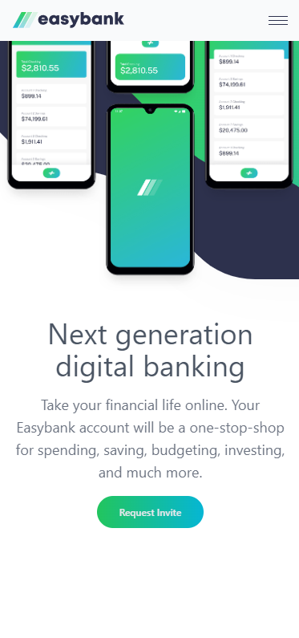

  

 

**Prueva de FrontendMentor [Easy Back](https://www.frontendmentor.io/challenges/easybank-landing-page-WaUhkoDN)**

## Autores

- Henry  [@Hhenry](https://github.com/hhenry14)
- Frontend Mentor  [@frontendMentor](https://www.frontendmentor.io/)

## Lenguajes

* HTML
* Tailwind CSS
* JavaScript

<!-- ALL-CONTRIBUTORS-LIST:END -->
## Imagen

<table>
<tr align="center">
<td align="center">

</td>
<td align="center">

</td>
</tr>
<tr>
<td align="center">

</td>
<td align="center">

</td>
</tr>

</table>

